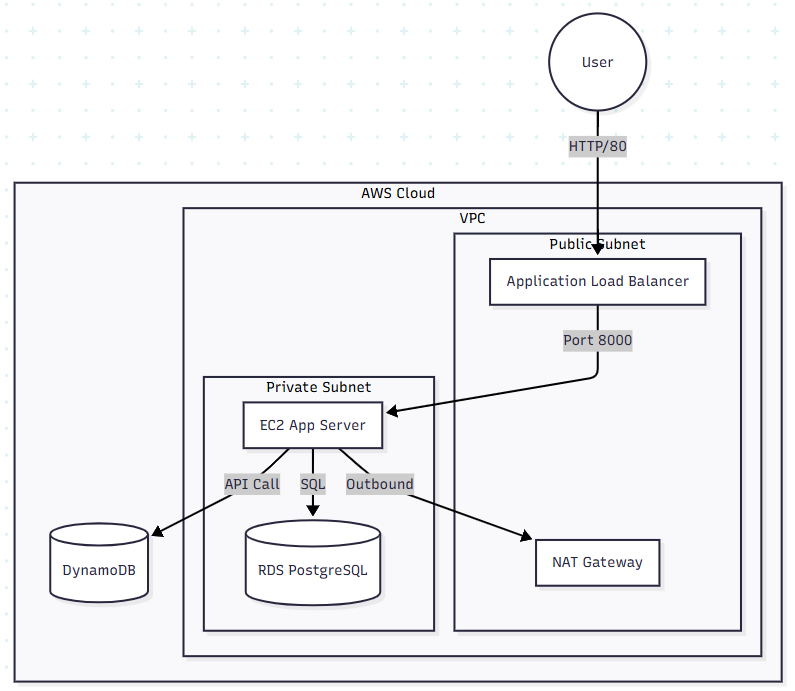
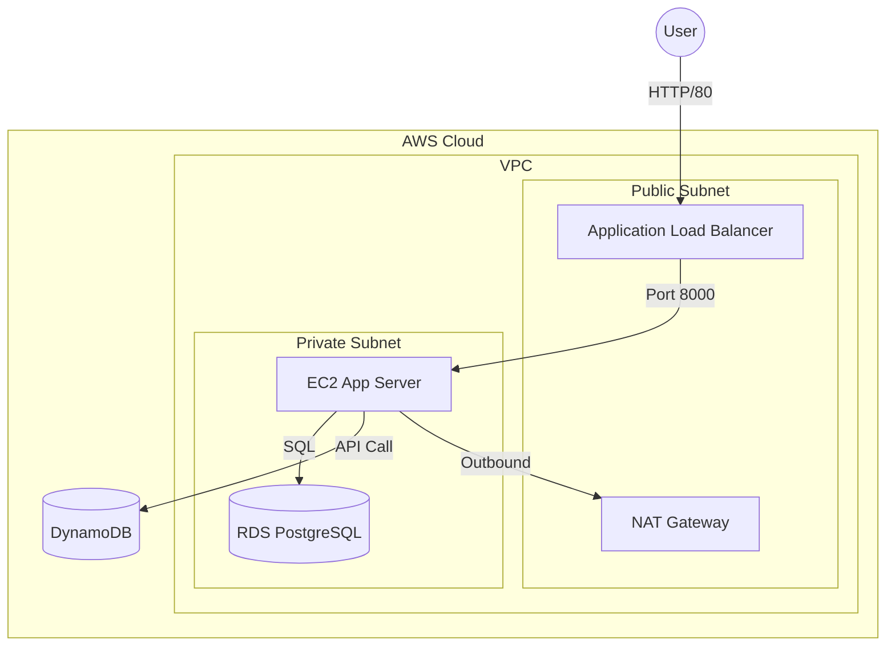

# ☁️ 무강대학교 AI 학사행정 인프라 구축 발표자료

## 📝 발표 개요
- **주제**: MSA 기반의 AI 학사행정 시스템 클라우드 인프라 구축
- **발표 시간**: 총 10분 (발표자 A: 5분, 발표자 B: 5분)
- **핵심 포인트**: Terraform을 활용한 IaC 구현과 AWS 리소스 선정의 기술적 근거

---

## 🗣️ 발표자 A: 인프라 아키텍처 및 네트워크 보안 설계 (0분 ~ 5분)

### 1. 프로젝트 기획 의도 및 기술 스택 (1분 30초)
- **Storytelling (기획 배경)**:
  - **문제 인식**: 기존 학사행정 시스템은 수강신청 기간의 **트래픽 폭주**와 단순 반복적인 **학사 문의** 처리에 취약했습니다.
  - **해결책**: 트래픽 유연성을 위한 **MSA(Microservices Architecture)** 도입과, 문의 자동화를 위한 **AI(RAG)** 기능을 결합했습니다.
  - **차별점**: 단순 구현을 넘어, **Terraform**을 이용한 인프라 자동화(IaC)로 '재현 가능한 인프라'를 구축했습니다.
- **주요 기술 스택 (Tech Stack)**:
  - **Infrastructure**: AWS (EKS, VPC, RDS, S3, ECR), Terraform
  - **Application**: Python FastAPI (Backend), Vanilla JS (Frontend)
  - **AI & Data**: Amazon Bedrock (LLM), Aurora PostgreSQL (pgvector)

### 2. 전체 아키텍처 및 네트워크 격리 전략 (1분 30초)
- **아키텍처 구조 (Architecture)**:

  - **트래픽 흐름**: 사용자 -> ALB(Public) -> EKS(Private) -> RDS(Private)로 이어지는 보안 중심의 3-Tier 구조입니다.
  - **AI 파이프라인**: S3 업로드 이벤트가 Lambda를 트리거하고, Bedrock이 추론하는 **이벤트 기반 아키텍처**를 적용했습니다.
- **Why Private Subnet? (보안)**:
  - 데이터베이스와 애플리케이션 로직이 실행되는 EKS 워커 노드는 해킹 위험을 막기 위해 외부에서 직접 접근할 수 없는 **Private Subnet**에 배치했습니다.
- **Why NAT Gateway? (가용성)**:
  - Private Subnet의 노드들이 외부 인터넷과 단절되면 도커 이미지를 받아오거나 보안 패치를 할 수 없습니다. 이를 위해 **NAT Gateway**를 두어, 밖에서는 못 들어오지만 안에서는 밖으로 나갈 수 있는 통로를 열어주었습니다.

### 3. 보안 그룹 및 접근 제어 (2분)
- **리소스**: `aws_security_group`, `Bastion Host`
- **Why Bastion Host? (운영 보안)**:
  - `db_connect.md` 가이드를 보시면, 개발자조차도 DB에 직접 접속할 수 없습니다.
  - 반드시 **Bastion Host(경비실 서버)**를 통해서만 **SSH 터널링**으로 접근하도록 설계하여, 운영 단계에서의 보안 구멍을 원천 차단했습니다.

---

## 🗣️ 발표자 B: 컴퓨팅, 데이터베이스 및 AI 파이프라인 (5분 ~ 10분)

### 4. EKS 컴퓨팅 리소스 최적화 (2분)
- **리소스**: `module.eks` (eks.tf)
- **Why EKS?**:
  - 수십 개의 마이크로서비스 컨테이너를 수동으로 관리하는 것은 불가능합니다. 쿠버네티스(EKS)를 도입하여 **오토스케일링**과 **자가 치유(Self-healing)** 기능을 확보했습니다.

- **★ 핵심 전략 1: 안정성 우선의 온디맨드(On-Demand) 채택**
  - `eks.tf`의 `capacity_type`을 보시면 `ON_DEMAND`로 설정했습니다.
  - **Why?**: 수강신청과 같이 중단되면 안 되는 핵심 서비스를 위해, 언제든 회수될 수 있는 스팟 인스턴스 대신 안정적인 온디맨드 인스턴스를 선택했습니다. 서비스의 신뢰성을 최우선으로 고려한 결정입니다.

- **★ 핵심 전략 2: 온디맨드 비용 상쇄 전략 (T3 + 노드 분리)**
  - `eks.tf` 코드를 보시면 워커 노드를 두 그룹으로 분리했습니다.
  1. **AI 워크로드용 (`ai_node_group`)**: `t3.small`
  2. **일반 웹/앱용 (`mugang_nodegroup`)**: `t3.medium`
  - **Why? (비용 효율화)**:
    - **Burstable 인스턴스**: T3 계열의 '버스터블' 기능을 활용해 평소에는 낮은 비용으로 운영하다가, 수강신청처럼 트래픽이 몰릴 때만 CPU 성능을 최대로 끌어올려 비용 효율을 극대화했습니다.
    - **워크로드 격리**: AI 작업과 일반 웹 트래픽의 부하 특성이 다르므로, 노드 그룹을 분리하여 서로의 성능 간섭을 막고, AI 노드에는 더 저렴한 `t3.small`을 할당해 비용을 추가로 절감했습니다.

### 5. 데이터베이스 전략 (1분 30초)
- **리소스**: `aws_rds_cluster` (Aurora PostgreSQL)
- **Why Aurora PostgreSQL?**:
  - 단순 RDS보다 성능과 가용성이 뛰어난 Aurora를 선택했습니다.
  - 특히 **pgvector** 확장이 용이하여, 향후 AI RAG(검색 증강 생성) 기능을 별도 벡터 DB 구축 없이 관계형 DB 레벨에서 바로 지원할 수 있도록 확장성을 고려했습니다.

### 6. AI 파이프라인 및 CI/CD (1분 30초)
- **리소스**: `GitHub Actions`, `ECR`, `Amazon Bedrock`
- **Why CI/CD?**:
  - `deploy.yml`을 통해 코드가 푸시되면 자동으로 도커 이미지가 빌드되고 ECR에 저장됩니다. 이를 통해 개발자가 인프라에 신경 쓰지 않고 코드에만 집중할 수 있는 환경을 만들었습니다.
- **Why Bedrock?**:
  - 자체 LLM을 호스팅하는 막대한 GPU 비용 대신, API 기반의 **Amazon Bedrock**을 사용하여 사용한 만큼만 비용을 지불하는 합리적인 구조를 택했습니다.

---

## 💡 예상 질문 및 답변 (Q&A 대비)

**Q1. 왜 굳이 노드 그룹을 AI용과 일반용으로 나누었나요?**
> A. `eks.tf`에서 보시듯 AI 작업과 일반 웹 트래픽은 리소스 사용 패턴이 다릅니다. 하나로 합치면 AI 작업이 CPU를 다 써버려서 수강신청 페이지가 느려질 수 있습니다. 이를 물리적으로 격리하여 서비스 안정성을 확보하기 위함입니다.

**Q2. 비용 절감 전략은 무엇인가요?**
> A. 안정성을 위해 온디맨드 인스턴스를 사용하면서도 비용을 최적화하기 위해 세 가지 전략을 사용했습니다.
> 1. **T3 Burstable 인스턴스**: 평소에는 저렴하게, 트래픽 폭증 시에만 성능을 최대로 사용합니다.
> 2. **워크로드 분리**: `eks.tf`에서 보시듯, AI용 노드 그룹에는 더 저렴한 `t3.small`을 할당했습니다.
> 3. **오토 스케일링**: 트래픽에 따라 노드 수를 자동으로 조절하여 불필요한 비용을 줄입니다.